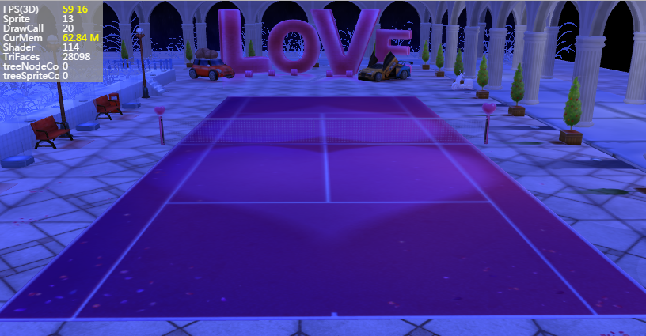

# LayaAir3D之材质概述

### 材质概述

材质就是物体的材料质感。例如木头、金属、玻璃、毛发、水等，他们的粗糙度、光泽度、反射、透明、颜色、纹理等材质属性都有所不同。

大多数3D引擎中都有独立的材质类用于程序代码控制，三维制作软件中材质处理也是最重要的部分之一。游戏美术开发者们经常有一句话，在3D游戏场景制作中，三分看模型，七分靠材质。

材质的种类也有很多，在三维制作软件中有标准材质、多维材质、合成材质、双面材质、光线跟踪材质等。在LayaAir3D引擎中目前主要支持的是标准材质StandardMatrial。


### 创建标准材质

如果在代码中的模型没有赋材质，在3D视图中无法显示模型的纹理、质感等，只默认为纯白色。

在“快速开启3D之旅”课程的代码中，我们创建使用了标准材质，并在漫反射贴图上添加了一张纹理图片，并赋给了模型。

```typescript
//创建材质
var material:Laya.PBRStandardMaterial = new Laya.PBRStandardMaterial();
//加载漫反射贴图
Laya.Texture2D.load("../../../../res/threeDimen/texture/earth.png", Laya.Handler.create(null, function(texture:Laya.Texture2D):void {
				//设置漫反射二维纹理贴图
				material.albedoTexture = texture;
				//为box模型赋材质
				box.meshRenderer.material = material;
			}));
```

当然，这只是简单的一种用法，我们暂时只运用了最重要的漫反射贴图，要达到更好的美术效果，开发者还需了解材质的光色与贴图属性。


### 材质的加载

在“LayaAir3D之模型”这篇文档中我们介绍了模型包括了模型网格与材质两部分，加载.ls、.lh数据时，会自动加载模型所对	应的材质。

最新的引擎版本中，模型网格与材质进行了分离，unity导出插件工具不再将材质与导出的.lm模型文件进行绑定。因此如果加载.lm格式资源，则需要重新赋予其材质才能完整显示，否则只显示为白模。

这时可以使用导出后产生的.lmat材质文件，加载创建标准材质并赋给模型，方式与模型加载类似。

```typescript
//异步加载材质文件创建标准材质（也可以预加载）
Laya.BlinnPhongMaterial.load("truck/Assets/Materials/t0200.lmat",Laya.Handler.create(this,function(mat):void{
  	box.meshRenderer.material = mat;
}));
```


### 从加载的模型上获取材质

在上面的例子中我们创建了标准材质，但在实际的项目运用中，我们很少用代码的方式给模型赋材质，而是直接在3D软件制作或在unity中创建材质，然后通过工具导出LayaAir格式后使用。

使用时引擎会自动在模型上加载材质，并且很多时候一个模型上会有多个标准材质，自动的方式为我们省下了很多开发时间。但在这种情况下，如果我们需要改变、更换材质怎么办呢？我们首先需要在模型上获取当前的材质。

LayaAir3D引擎为我们提供了网格渲染器MeshRenderer类和蒙皮动画网格渲染器SkinnedMeshRenderer，在可视模型上提供了它们的实例，我们可以通过它们来获取模型上的材质。

Tips：MeshSprite3D模型中为MeshRenderer，SkinnedMeshSprite3D模型中为SkinnedMeshRenderer。

获取的材质跟为两种类型，一种是自身材质Material，如果自身材质被修改了，只有自身模型显示进行变化；一种是共享材质SharedMaterial，因为材质相对独立，多个模型都可以用同一个材质，如果获取的是共享材质并修改了，自身模型显示会变化，其他模型用到这个材质的部分也会发生改变。因此，开发者们需要根据情况进行选择。


### 获取并修改自身材质

```typescript
......
//加载导出的卡车模型
Laya.Sprite3D.load("LayaScene_truck/truck.lh",Laya.Handler.create(this,function(sp:Laya.Sprite3D):void{
    var truck:Laya.Sprite3D = scene.addChild(sp)as Laya.Sprite3D;
    //获取车身模型（查看.lh文件，模型	中两个对象，车头“head”与车身"body",它们都用同一个材质）
    var meshSprite3D:Laya.MeshSprite3D = truck.getChildAt(1).getChildAt(0) as Laya.MeshSprite3D;
    //从模型上获取自身材质
	var material:Laya.BlinnPhongMaterial = meshSprite3D.meshRenderer.material as Laya.BlinnPhongMaterial;
    //修改材质的反射颜色，让模型偏红
	material.albedoColor = new Laya.Vector4(1,0,0,1); 
}));
```

编译运行后如下，虽然车身与车头模型都用了同一材质，但只修改了车身的自身材质为红色，不影响车头（图1）

(图1)</br>


### 获取并修改共享材质

```typescript
......
//加载导出的卡车模型
Laya.Sprite3D.load("LayaScene_truck/truck.lh",Laya.Handler.create(this,function(sp:Laya.Sprite3D):void{
    var truck:Laya.Sprite3D = scene.addChild(sp)as Laya.Sprite3D;
    //获取车身模型（查看.lh文件，模型	中两个对象，车头“head”与车身"body",它们都用同一个材质）
    var meshSprite3D:Laya.MeshSprite3D = truck.getChildAt(1).getChildAt(0) as Laya.MeshSprite3D;
    //从模型上获取自身材质
	var material:Laya.BlinnPhongMaterial = meshSprite3D.meshRenderer.sharedMaterial as Laya.BlinnPhongMaterial;
    //修改材质的反射颜色，让模型偏红
	material.albedoColor = new Laya.Vector4(1,0,0,1); 
}));
```

编译运行效果如下，修改了共享材质后，因为车头与车身模型都使用了该材质，他们的材质都被改变了（图2）

(图2)</br>


### 获取并修改材质列表

在3D制作软件中，经常会有一个模型有多个材质的情况，我们称之为多维材质。不过经过工具导出数据加载后，引擎会自动创建成模型的材质列表数组materials或sharedMaterials，因此在修改材质时，可以用for循环或递归的方式进行。

下列代码提供了对模型或模型容器子对象获取并修改材质的方法，我们直接对所有场景子对象进行了材质修改。

```typescript
......
......
//加载场景
Laya.Scene3D.load("LayaScene_loveScene/loveScene.ls",Laya.Handler.create(this,function(s:*):void{
	var scene:Laya.Scene3D = Laya.stage.addChild(s)as Laya.Scene3D;
    this.setModelMaterial(scene);
}))
....
/**
*修改模型材质
* @param model 场景或模型
 */		
private setModelMaterial(model):void
{
  //如果是模型网格显示对象
  if (model instanceof Laya.MeshSprite3D) 
  {
    //获取模型网格对象
    var meshSprite3D:Laya.MeshSprite3D = model as Laya.MeshSprite3D;
    for(var i :number = 0; i < meshSprite3D.meshRenderer.sharedMaterials.length;i++)
	{
		//根据下标获取模型共享材质组中的共享材质
		var material:Laya.BlinnPhongMaterial = materials.skinnedMeshRenderer.sharedMaterials[i] as             Laya.BlinnPhongMaterial;
		material.albedoColor = new Laya.Vector4(0,0,1,1)
	}
  }
  //如果是蒙皮模型网格显示对象
  if (model instanceof Laya.SkinnedMeshSprite3D) 
  {
    //获取蒙皮模型网格显示对象
    var skinnedMeshSprite3D:Laya.SkinnedMeshSprite3D = model as Laya.SkinnedMeshSprite3D;
	for(var i :number = 0; i < skinnedMeshSprite3D.skinnedMeshRenderer.materials.length;i++)
    {
      //根据下标获取模型共享材质组中的共享材质
      var material:Laya.BlinnPhongMaterial = materials.meshRenderer.sharedMaterials[i] as Laya.BlinnPhongMaterial;
      material.albedoColor = new Laya.Vector4(0,0,1,1)
    }
  }
  //递归方法获取子对象
	for (var i:number = 0; i < model._children.length; i++)
 	{
    	this.setModelMaterial(model._children[i]);
    }
}
```

编译运行后效果如下（图3），场景中所有的模型材质都加上了一层蓝色。

(图3)</br>