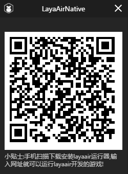
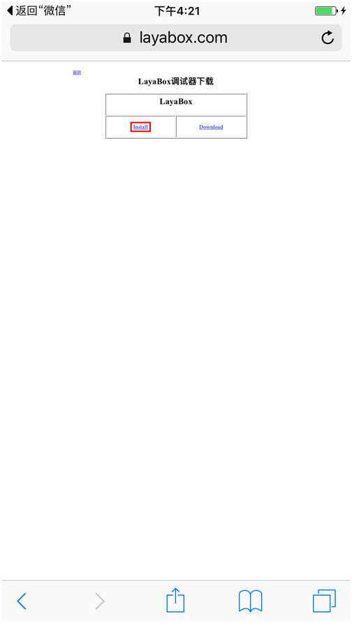
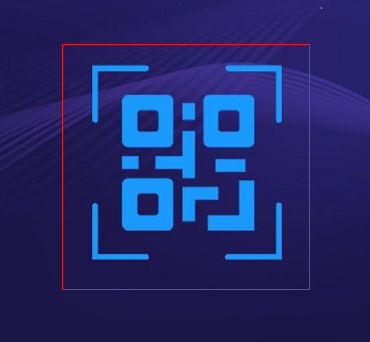

# 如何用LayaNative测试App运行项目

### 一、测试App的下载与安装

#### 1.显示测试App的下载二维码

打开LayaAirIDE，点击左上角的菜单按钮，弹出菜单栏（如图1）。

点击菜单栏中的“工具”->“运行器下载”，弹出测试App的二维码下载地址（如图2）。

   
  图1

​   
​  图2

#### 2.Android版本的下载和安装

直接用android手机进行扫码，点击apk进行安装即可。

**Tips：如果使用微信扫码，由于微信的安全设置，扫码后需要复制链接地址到手机浏览器中进行下载。**    

#### 3.iOS版本的下载和安装

　　用微信扫码后，点击“在Safari中打开”，在Safari浏览器中打开后点击**Install**按钮，然后点击安装即可，如下图所示：

**步骤1：**

​  
​ 图3

**步骤2：**

   
  图4

**步骤3：**

   
  图5

**Tips：**

点击安装后，这里没有自动跳转功能，需要手动去系统桌面上看一下，是否存在Layabox的应用正在安装，如果正在安装，就等待安装结束后进行下一步操作。

**步骤4：**

安装成功后，点击运行会弹出"未受信任的企业开发者"，这个时候需要开发者自己进行设置一下。

点击"设置"-->"通用"-->"设备管理"-->"点击LayaBox Network Technology.."-->"点击信任"。

之后再打开LayaBox测试App就可以正常使用了，具体步骤如下所示：

**步骤5：**

​  
​	图6

**步骤6：**

​	 
​	图7

**步骤7：**

​	 
	图8

**步骤8：**

​	 
​	图9

**步骤9：**

​	 
​	图10

### 二、使用测试App进行项目的测试

**步骤1：**

打开应用之后，会看见如图11的界面：

 
图11

**步骤2：**

使用LayaAirIDE打开案例项目，点击菜单栏最右侧的二维码图标  ，显示项目的二维码界面(如图12)。

   
  图12

**步骤3：**

点击测试APP内的蓝色二维码图标（图13），进入扫码的界面。扫描右侧的layanative的二维码（图14），即可开启测试。

   
  图13

   
  图14

扫码成功后，测试App会运行案例项目（图15）。

<!-- TODO: 也许需要换个项目的图片    -->

   
  图15

**Tips：LayaNative不是浏览器，输入地址的请输入全路径，即使默认启动的是index.html，也要输入/index.js。**

* http://testgame.layabox.com/index.js 正确  
* http://192.168.0.100:8899/index.js 正确  
* http://testgame.layabox.com/ 错误    
* http://testgame.layabox.com 错误  
* http://192.168.0.100:8899/ 错误  
* http://192.168.0.100:8899 错误  

**Tips：输入地址后，如果发现屏幕上没有显示任何画面，有可能是因为项目没有正确设置横竖屏，请参考文档：https://github.com/layabox/layaair-doc/tree/master/Chinese/LayaNative/screen_orientation**

### 三、注意事项

　　文本格式的文件（例如:ini、xml、html、json、js等）都必须是utf8编码格式，因为IOS设备现在尚不支持非utf8格式编码的文件。

### 四、建议

　　建议开发者学习一下android和ios开发的基本知识，使用过程中可以把移动设备连接到电脑上，随时查看log，log中有很多重要的信息，可以帮助开发者定位问题。比如：非utf8格式编码的文件名字、网络错误、下载错误等等。