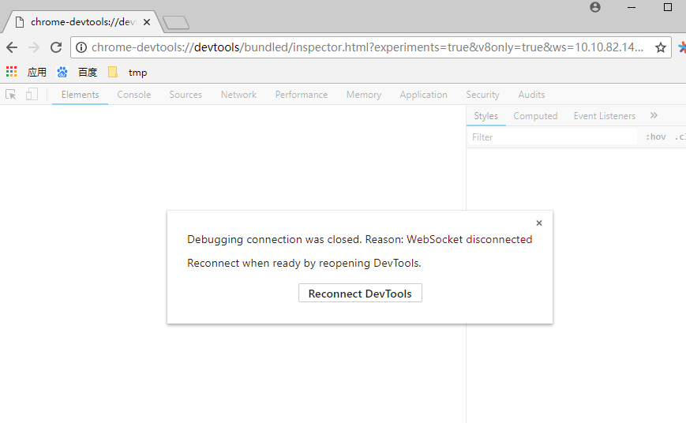

# 在android真机上调试JavaScript代码

## 一、 项目发布前的调试步骤

### 步骤1：确认ip地址和端口号

打开测试App, 可以再左上角看到Android设备的ip地址和测试App需要的端口号。

如图1所示，设备的ip地址为10.10.82.142，端口号为：5959。

图1

### 步骤2：扫描项目的二维码

点击测试App中间的蓝色二维码图标，扫描项目的layanative的二维码地址。等待项目成功运行。

### 步骤3：在Chrome浏览器中连接测试App

当项目成功运行后，打开Chrome浏览器，输入以下网址：

>chrome-devtools://devtools/bundled/inspector.html?experiments=true&v8only=true&ws=10.10.82.142:5959

**注意：** ws=10.10.82.142:5959是步骤1中查看的ip地址和端口号，请根据自己设备的实际情况进行更改。

### 步骤4：进行调试

连接成功后，便可以使用Chrome对项目中JavaScript进行调试。如图3所示：

图3

## 二、项目发布后的调试步骤

### 步骤1: 

使用LayaAirIDE对项目进行构建，生成Android的工程。

具体可参考“使用IDE构建工程”。

### 步骤2：

使用Android Studio打开工程。

打开android_studio/app/src/main/assets/config.ini，修改JSDebugMode=2的值为2。如图4：

图4

### 步骤3：

打开Chrome，并输入以下网址：

>chrome-devtools://devtools/bundled/inspector.html?experiments=true&v8only=true&ws=10.10.82.142:5959

**注意：** ws=10.10.82.142:5959里的10.10.82.142是Android测试机的ip地址，5959是步骤2中config.ini文件里JSDebugPort设置的端口号值，请根据自己设备的实际情况和需求进行更改。

### 步骤4：

USB连接好测试机，编译运行工程。等待Chrome弹出图5窗口。

图5

点击图5中的"Reconnect DevTools"按钮，成功连接测试机后，即可使用Chrome调试项目中的JavaScript代码。

## 三、调试的原理

调试的情况下，LayaNative会启动一个WebSocket服务器。通过WebSocket协议实现使用Chrome的调试器对LayaNative项目进行调试。

## 四、目前版本存在的问题

**以下的问题会在以后的版本里解决，敬请谅解。**

1. Chrome连接情况下，测试App点击刷新按钮时会有崩溃的情况。

图6

2.在调试器调试的过程中，使用调试器添加的断点（非debugger断点)，有几率会出现调试混乱。
如果遇到这种情况，请按以下步骤进行处理：

步骤1：设置的断点如下

图7

步骤2：取消所有的断点

图8

步骤3：重启启动工程，再使用Chrome连接工程。

图9

步骤4：恢复需要的断点

图9